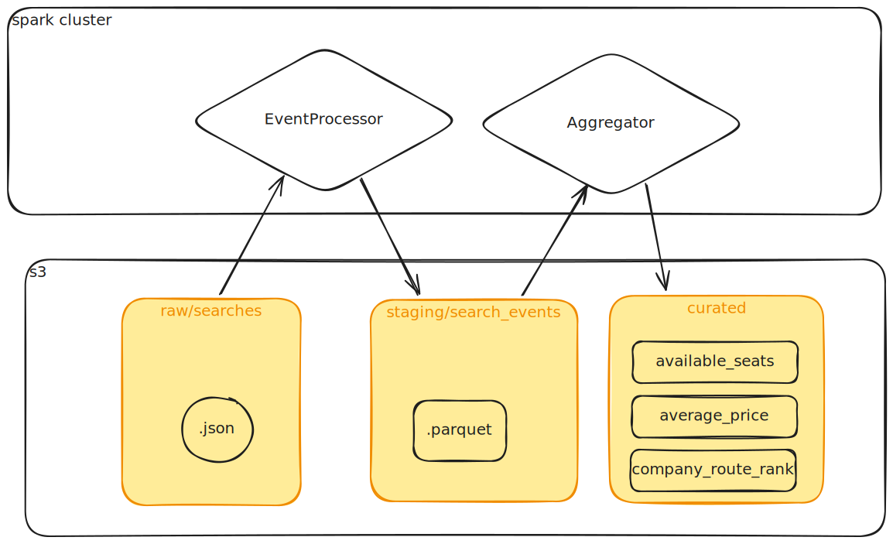

# Solução



Esse projeto foi desenvolvido utilizando linux, dessa forma é recomendável utilizar alguma distribuição da sua escolha para a realização dos testes.

Todos os scripts principais, bem como funções auxiliares pode mser encontradas na pasta [scripts](scripts/)

## Requisitos
  - [make](https://pt.linux-console.net/?p=14595): Para a execução do makefile
  - [docker](https://docs.docker.com/engine/install/ubuntu/): para a execução dos containeres

## Arquitetura básica

## Processo de execução

### 1. Configurar minio
Para trazer o conteúdo do zip para dentro do data-lake rode o comando

```bash
# Cria datalake com arquivos .json
make setup_minio
```
Ele irá o arquivo data.json para dentro do datalake [click/raw/searches](localhost:9001/browser/click/raw/searches/). Para acessar o lake utilize as senhas [1]

### 2. Iniciar cluster spark
Para o processo exeutar de forma adequada o cluster spark precisa estar em execução. Para isso execute o comando a seguir:
```bash
# inicia clister spark
make up
```
### 3. Executar ETL
Com o cluster em execução rode o seguinte comando
```bash
# executa pipeline
make pipeline
```

Nessa etapa o script de [pipeline](scripts/pipeline.py) executa 2 ETLs:

**Raw -> Staging**:
- [EventProcessor](scripts/event_processor.py):
  - Lê arquivos json
  - Cria colunas `departure_datetime`, `arrival_datetime` e `route`
  - Salva dados em [staging](http://localhost:9001/browser/click/staging/search_events/) particionados pelas colunas `originState` e `destinationState`

**Staging -> Curated**:
- [Aggregator](scripts/aggregator.py):
  - Lê arquivos de [staging](http://localhost:9001/browser/click/staging/search_events/)
  - Calcular o preço médio por rota e classe de serviço
  - Determinar o total de assentos disponíveis por rota e companhia
  - Identificar a rota mais popular por companhia de viagem.

  - Salva uma tabela para cada um dos levantamentos em [curated](http://localhost:9001/browser/click/curated/)


**Observações:**

Optou-se por separar o processamento do evento ([EventProcessor](scripts/event_processor.py)) da agregação ([Aggregator](scripts/aggregator.py)), pois os dados podem ser consumidos por outros ETLs sem a necedidade de refazer as etapas iniciais.

A classe [Writer](scripts/writer.py) é injetada dentro do script de forma que não os ETLs não precisam ter conhecimento específico de como os dados são gravados. Além disso, um conjunto de funções auxiliares foram criadas no arquivo [functions.py](scripts/functions.py) permitindo que seja reusado por outros ETLs quando necessário.

### 4. Conteúdo final
Ao termino da execução haverão 3 tabelas dentro da camada curated:

**average_price**
```
+---------------------------+------------+-------------+
|route                      |serviceClass|average_price|
+---------------------------+------------+-------------+
|RIO DE JANEIRO -> SÃO PAULO|EXECUTIVO   |180.5        |
|BELO HORIZONTE -> BRASÍLIA |LEITO       |450.0        |
|CURITIBA -> JOINVILLE      |CONVENCIONAL|95.0         |
+---------------------------+------------+-------------+
```

**available_seats**
```
+------------------+---------------------------+---------------------+
|travelCompanyName |route                      |total_available_seats|
+------------------+---------------------------+---------------------+
|Rapido Vermelho   |RIO DE JANEIRO -> SÃO PAULO|12                   |
|VIAGEM CONFORTÁVEL|BELO HORIZONTE -> BRASÍLIA |5                    |
|TURISMO FÁCIL     |CURITIBA -> JOINVILLE      |25                   |
+------------------+---------------------------+---------------------+
```
**company_route_rank**
```
+------------------+---------------------------+
|travelCompanyName |route                      |
+------------------+---------------------------+
|Rapido Vermelho   |RIO DE JANEIRO -> SÃO PAULO|
|TURISMO FÁCIL     |CURITIBA -> JOINVILLE      |
|VIAGEM CONFORTÁVEL|BELO HORIZONTE -> BRASÍLIA |
+------------------+---------------------------+
```

### 2. Parar cluster
Para para o cluster utilize o seguinte comando:
```bash
# para cluster spark
make down
```

# Referências
[1] Senhas de acesso ao [minio](http://localhost:9001)
  - usuário: minio_key
  - senha: minio_secret